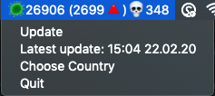

# COVID-19 Tray Data

This application shows current coronavirus data in your country in your MacOS tray menu.



To build the app, clone the repo and run
```
npm run make
```

### Credits
The app is based on data from this repo:
https://github.com/NovelCOVID/API